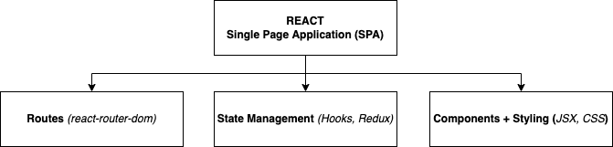
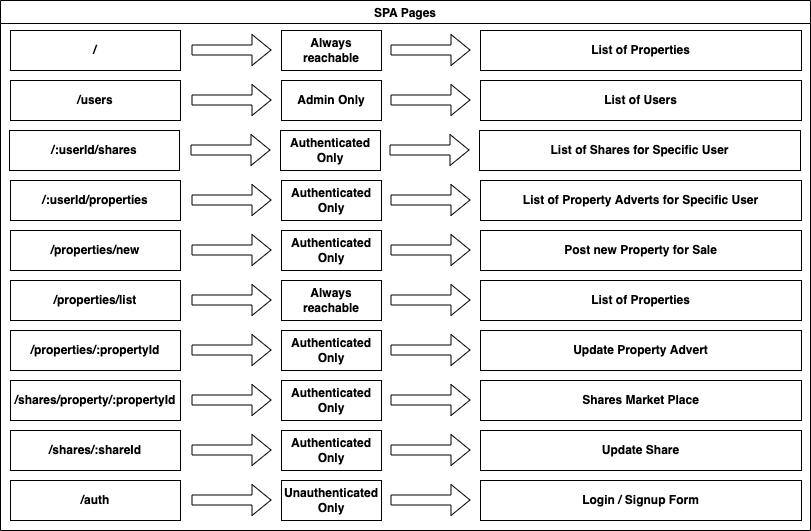

# FRACTIONAL PROPERTY OWNERSHIP SINGLE PAGE APPLICATION(SPA) WITH REST API

[FPInvest Web App](https://fpinvest.web.app/)
[User Survey](https://surveyhero.com/c/qk3rnz9z) 

The project has build a single page application with RESTful API using the MERN stack, where users are able to purchase a fraction of a property during the initial sale and trade on the secondary market. The later abbreviation stands for Mongo database, ExpressJS and ReactJS frameworks, and NodeJS runtime environment.

The project uses JavaScript based technologies, for the entire development cycle from front-end to back-end and noSQL database. Furthermore, the Single-page Application(SPA) model demonstrates quick loading time and seamless user experience by dynamically rewriting the current web page. Finally, project deployment was conducted using Heroku and Firebase Platforms.

## Technologies: MERN Stack

MERN (MongoDB, ExpressJS, ReactJS, NodeJS) Full Stack

## Frond-end: Single Page Application(SPA)(ReactJS)

* Only one HTML page
* React JSX structure and virtual DOM
* React renders various combination of UI components
* React routing implemented for navigation on the client-side and passing data

## Back-end: REST API(ExpressJS, NodeJS)

* Node runtime environment
* Express framework used for building the routing of the APIs 
* Server-side decoupled from client-side

## Authentication && Authorisation

* POST, PATCH, DELETE APIs are protected
* BCrypt algorithm used for password encryption
* Token Design due to stateless server
* Asymmetric cryptography algorithm used to generate token
* Jason Web Token(JWT) is attached to the request
* Incoming request validated 

## Application Deployment

* Environmental variables for sensitive data
* SPA production build for performance optimisation
* Code splitting for performance optimisation
* Separate application for the client-side and server-side (less request-better performance, unconstrained and compatible with more than one end) 

